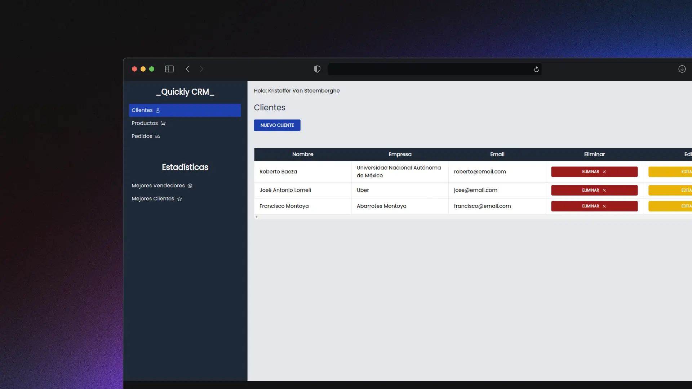

# 📊 CRM con GraphQL

    

[![@im-krizox/crm-graphql-frontend][frontend-badge]][frontend-url]

[frontend-badge]: https://img.shields.io/badge/Frontend-181717?style=flat&logo=github
[frontend-url]: https://github.com/im-krizox/crm-graphql-frontend

